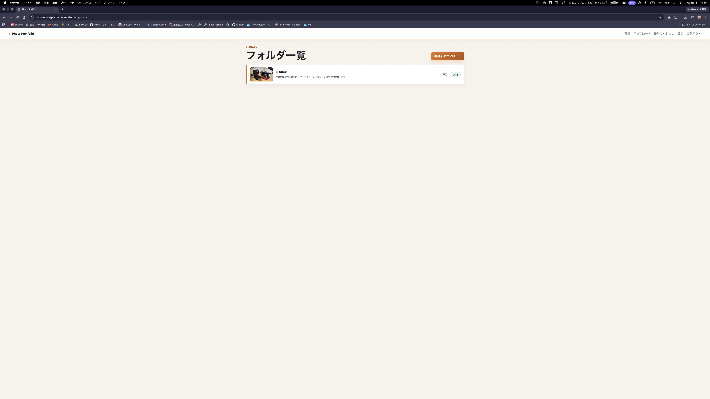
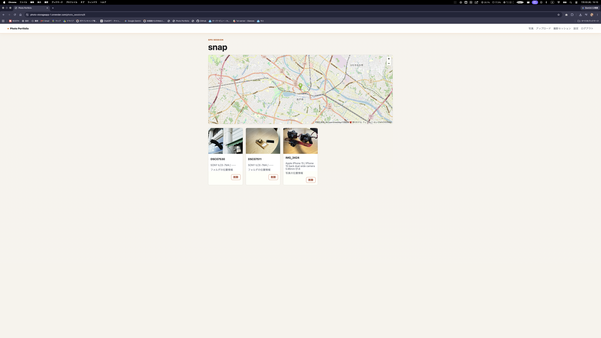

# Photo Portfolio

写真のアップロード、EXIF情報の取得、撮影日時・GPS情報をもとにしたフォルダー管理ができる写真管理アプリです。

## URL

https://photo-storageapp-1.onrender.com

## サービス概要

Photo Portfolio は、アップロードした写真を撮影情報に基づいて自動整理できるWebアプリケーションです。

写真に含まれるEXIF情報から撮影日時やGPS情報を取得し、撮影セッションとして管理できます。  
GPS情報がある写真は位置情報付きの撮影データとして扱い、GPS情報がない写真も撮影日時をもとに整理できるようにしています。

## 作成背景

写真を撮っていると、撮影日や撮影場所ごとに写真を整理する作業が手間になることがあります。

特に一眼カメラやスマートフォンで撮影した写真は、EXIF情報に撮影日時・カメラ情報・GPS情報などが含まれているため、それらを活用すれば自動で整理できると考えました。

このアプリでは、写真をアップロードするだけで撮影情報を読み取り、あとから見返しやすい形で管理できることを目指しました。

## 主な機能

- ユーザー登録・ログイン
- ゲストログイン
- 写真アップロード
- EXIF情報の取得
- 撮影日時の取得
- GPS情報の有無の判定
- 撮影セッションの自動作成
- フォルダー一覧表示
- 写真一覧表示
- カメラ情報の表示
- レンズ情報の表示
- ISO / F値 / シャッタースピードの表示

## 使用技術

### バックエンド

- Ruby
- Ruby on Rails 7.2.3
- PostgreSQL
- Active Storage

### フロントエンド

- HTML
- CSS
- JavaScript
- Hotwire / Turbo

### インフラ

- Render
- Render PostgreSQL

### その他

- GitHub
- EXIFR

## 画面イメージ

### フォルダー一覧


### フォルダ内



### 写真アップロード

写真をアップロードすると、EXIF情報を読み取り、撮影日時やGPS情報をもとに分類します。

## 工夫した点

### EXIF情報を活用した自動整理

写真に含まれる撮影日時やGPS情報を読み取り、手動でフォルダー分けをしなくても整理できるようにしました。

### GPS情報の有無による分類

GPS情報がある写真とない写真で処理を分け、位置情報がない写真でも撮影日時をもとに管理できるようにしました。

### ゲストログイン機能

ユーザー登録をしなくてもアプリの動作を確認できるように、ゲストログイン機能を実装しました。

### Renderへのデプロイ

Renderを使用してRailsアプリを本番環境にデプロイしました。  
本番環境ではPostgreSQLを使用し、環境変数を用いてデータベース接続や認証情報を管理しています。

## 今後追加したい機能

- 地図表示機能
- 撮影場所ごとの自動グループ化
- GPS情報が大きく離れている場合の別フォルダー作成
- RAWファイル対応
- 写真検索機能
- タグ機能
- クラウドストレージ対応
- レスポンシブデザインの改善

## ER図

準備中

## インストール方法

```bash
git clone https://github.com/kioiu/photo_storageapp.git
cd photo_storageapp
bundle install
rails db:create
rails db:migrate
rails s